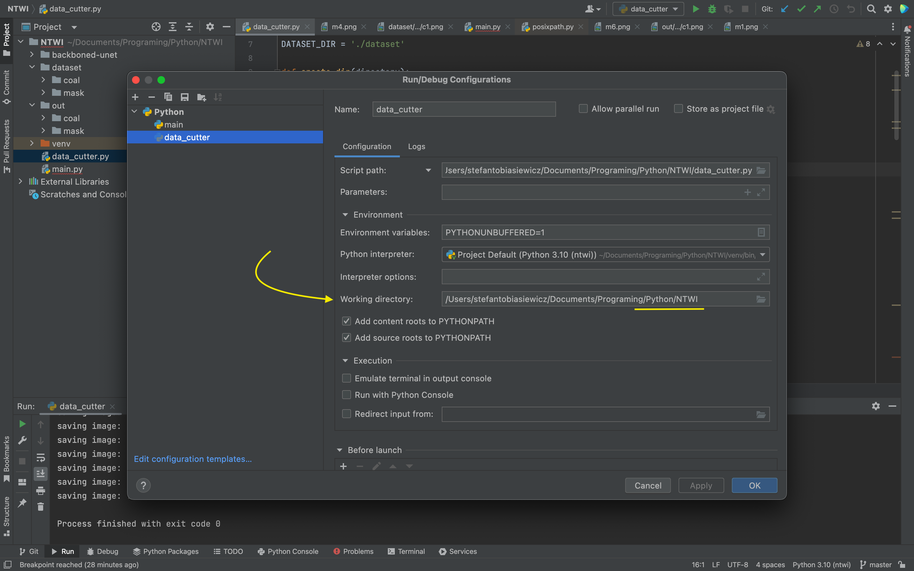

# Segmentation of coal rocks

To prepare dataset for main application run 
```data_cutter.py``` with work dir setted to root of this repository.

example of configuration:


After running script folder ```./out``` will be created with cuted and simple augmented coal picture and mask. 
